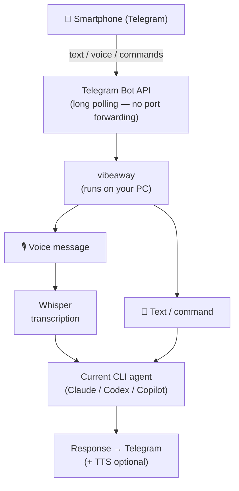
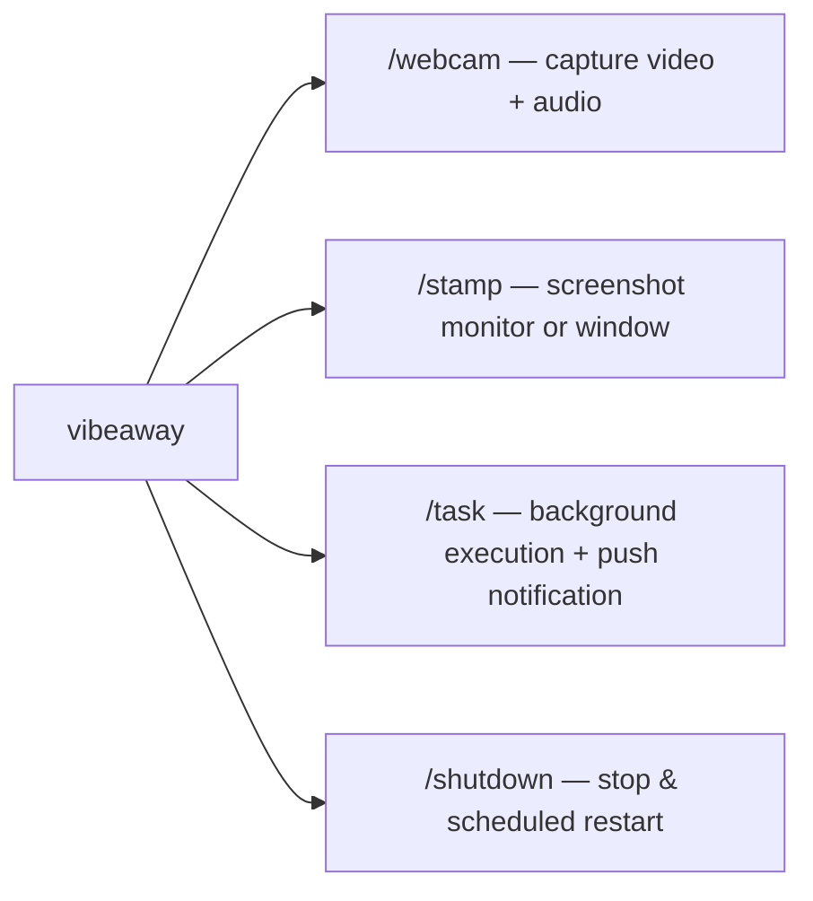
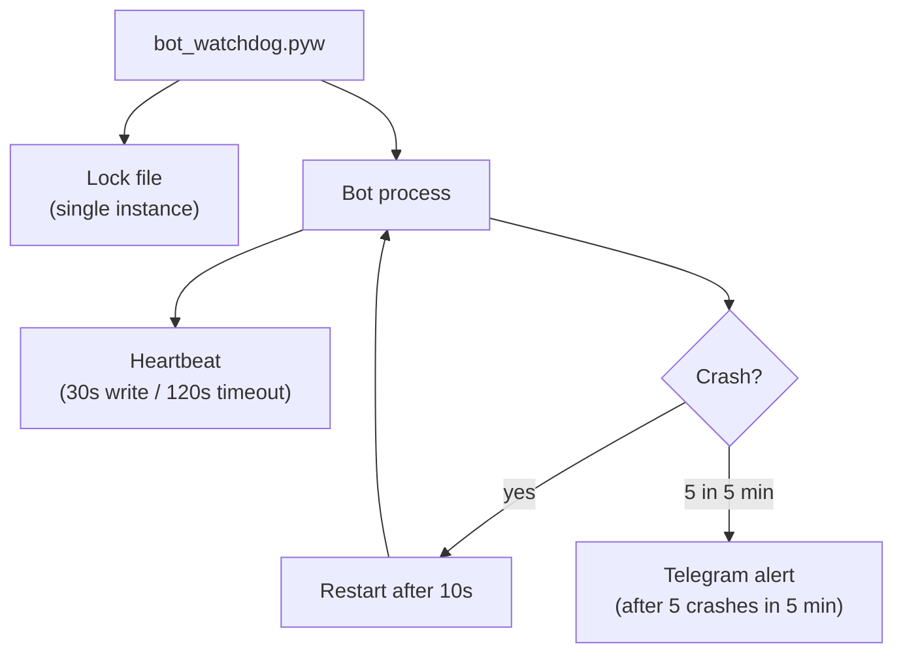

# VibeAway

[](https://www.python.org/downloads/)
[](LICENSE)
[](#tests)

Remote interface for local coding CLIs: send **text** or **voice** messages from
Telegram and the bot executes them via the selected agent on your machine,
returning the response in chat.

**Supported agents:**
[Claude Code](https://docs.anthropic.com/en/docs/claude-code) ·
[Codex CLI](https://github.com/openai/codex) ·
[GitHub Copilot CLI](https://docs.github.com/en/copilot/github-copilot-in-the-cli)

**Cross-platform:** Windows · Linux · macOS &nbsp;|&nbsp; **Localized:** en · it · fr · de · es · pt

---

## Background

This project was built in eight iterative conversations with an AI, starting
from a single frustration: Claude Code is doing my job — why on earth should
I stay here watching it, even when I could be doing something more interesting
outside?

The article [**From Vibe Coding to Mobility Coding**](https://donatomallozzi.github.io/vibeaway/vibeaway-article-en.html)
tells the full story — why Telegram was chosen over a REST API or web app
(long polling, native voice, zero network config), how each phase revealed
the next problem to solve, and the architectural decisions made along the way:

- **Sessions** — reading Claude Code's JSONL files to list and resume past conversations
- **Async** — switching to `asyncio.create_subprocess_exec()` to handle long-running tasks with push notifications and cancellation
- **Voice commands** — using an LLM as intent classifier to dispatch transcribed audio to specific bot commands
- **Live streaming** — `--output-format stream-json` with periodic Telegram message edits and a ▌ cursor
- **Security** — a regex risk filter across six categories with Telegram inline confirm/cancel buttons

> *"In eight conversations started from a single frustration, we built something I hadn't planned to build."*

---

## How it works



### Extra capabilities



---

## Prerequisites

| Component | Windows | Linux | macOS |
|---|---|---|---|
| Python ≥ 3.10 | python.org or winget | `apt install python3` | `brew install python` |
| ffmpeg | [gyan.dev](https://www.gyan.dev/ffmpeg/builds/) or winget | `apt install ffmpeg` | `brew install ffmpeg` |
| At least one CLI agent | See table below | | |

| Agent | Install |
|---|---|
| Claude Code | `npm install -g @anthropic-ai/claude-code` |
| Codex CLI | Install and expose `codex` in `PATH` |
| GitHub Copilot CLI | Install and expose `copilot` in `PATH` |

---

## Project structure

```
vibeaway/
├── pyproject.toml                    # Package metadata & dependencies
├── src/vibeaway/          # Installable package
│   ├── __init__.py
│   ├── __main__.py                   # Entry point: python -m vibeaway
│   ├── bot.py                        # Telegram handlers, commands (~2700 lines)
│   ├── agents.py                     # CLI agent adapters (Claude, Codex, Copilot)
│   ├── config.py                     # Configuration from .env
│   ├── paths.py                      # Runtime paths (~/.vibeaway/)
│   ├── session_backends.py           # Session/metadata backends per CLI agent
│   ├── session_manager.py            # Backward-compatible session facade
│   ├── transcriber.py                # Audio transcription (Whisper)
│   ├── tts.py                        # Text-to-Speech (OpenAI / gTTS)
│   └── locales/                      # Built-in locale files
│       ├── __init__.py               # Locale loader with deep-merge overrides
│       ├── en.json
│       ├── it.json
│       ├── fr.json
│       ├── de.json
│       ├── es.json
│       └── pt.json
├── service/                          # Service management (cross-platform)
│   ├── install.py                    # Setup runtime (~/.vibeaway/)
│   ├── deploy.py                     # Safe deploy with Telegram notifications
│   ├── install-service.ps1           # Register service (Windows, admin)
│   ├── install-service.sh            # Register service (Linux / macOS)
│   ├── bot_watchdog.pyw              # Cross-platform watchdog
│   ├── run_bot.bat                   # Manual launcher (Windows, dev)
│   └── use-local-bot.ps1            # Dev helper: run from repo
├── tests/                            # 177 tests (pytest + pytest-asyncio)
└── .env.example                      # Configuration template
```

**Runtime directory** (created by `install.py`):

```
~/.vibeaway/
├── .env              # Configuration
├── venv/             # Dedicated virtual environment
├── logs/             # bot.log + watchdog.log
├── service/          # Deployed watchdog + lock file
└── locales/          # User locale overrides (optional)
```

---

## Installation

### 1. Clone the repository

```bash
git clone https://github.com/donatomallozzi/vibeaway.git
cd vibeaway
```

### 2. Create the Telegram bot

1. Message **@BotFather** on Telegram → `/newbot`
2. Choose a name and username, copy the **token**
3. Get your user ID from **@userinfobot** → `/start`

### 3. Run the installer

```bash
python service/install.py
```

This creates `~/.vibeaway/` with a dedicated venv, dependencies, and a `.env` template to configure.

### 4. Configure

<details>
<summary><b>Windows</b></summary>

```powershell
notepad $env:USERPROFILE\.vibeaway\.env
```
</details>

<details>
<summary><b>Linux / macOS</b></summary>

```bash
nano ~/.vibeaway/.env
```
</details>

Minimum required settings:

```ini
TELEGRAM_BOT_TOKEN=your_token
ALLOWED_USER_IDS=your_user_id:YourName
WORKDIR=/home/youruser/projects
```

See [`.env.example`](.env.example) for all available options (Bedrock auth, transcription, TTS, webcam, etc.).

### 5. Register as a service (optional)

<details>
<summary><b>Windows</b> — Task Scheduler (requires admin)</summary>

```powershell
.\service\install-service.ps1
```

Registers a scheduled task that starts the watchdog at login, restarts on wake, and prevents duplicate instances.

Verify:
```powershell
Get-ScheduledTask -TaskName VibeAway | Select State
```
</details>

<details>
<summary><b>Linux</b> — systemd user service</summary>

```bash
bash service/install-service.sh
```

Creates a `systemd --user` service with auto-start at login and crash recovery. With `enable-linger`, stays active without a login session.

```bash
systemctl --user status vibeaway
journalctl --user -u vibeaway -f
```
</details>

<details>
<summary><b>macOS</b> — launchd LaunchAgent</summary>

```bash
bash service/install-service.sh
```

Creates a LaunchAgent with `RunAtLoad` and `KeepAlive` (30s throttle between restarts).

```bash
launchctl list | grep vibeaway
tail -f ~/.vibeaway/logs/watchdog.log
```
</details>

### 6. Manual start (development)

```bash
pip install -e ".[dev,local-whisper,tts]"
python -m vibeaway
```

---

## Updating

The deploy script pulls, validates, notifies you on Telegram, and only then
stops the bot for the shortest possible downtime:

```bash
cd vibeaway
python service/deploy.py
```

If anything fails before the restart, the bot keeps running and you get a
Telegram notification with the error. See [OPERATIONS.md](OPERATIONS.md) for
the full sequence and manual alternatives.

---

## Commands

All commands accept `/cmd` or `.cmd` prefix (dot = slash). Type `/help` to see shortcuts and locale aliases.

### Sessions

| Command | Shortcut | Description |
|---|---|---|
| `/start` | | Welcome + help |
| `/help` | `/h` | Show all commands |
| `/reset` | `/new` | New conversation |
| `/sessions [N]` | `/ss` | List saved sessions |
| `/resume <n>` | `/re` | Resume a session |

### Background tasks

| Command | Shortcut | Description |
|---|---|---|
| `/task <prompt>` | `/t` | Run in background |
| `/tasks` | `/jobs` | List running tasks |
| `/cancel [id]` | `/kill` | Cancel a task |
| `/bg` | | Move inline execution to background |
| `/fg [id]` | | Bring task to foreground |

### Navigation & files

| Command | Shortcut | Description |
|---|---|---|
| `/cd <path>` | | Change directory |
| `/ls [path]` | | List files |
| `/head [-N] <file>` | | First N lines |
| `/tail [-N] <file>` | | Last N lines |
| `/sendme <path>` | `/dl` | Download a file |
| `/windows [filter]` | `/wl` | List open windows |
| `/stamp [title]` | | Screenshot |
| `/webcam [seconds]` | `/cam` | Record webcam video |

### Settings & info

| Command | Shortcut | Description |
|---|---|---|
| `/settings` | `/env` | Show full configuration |
| `/agent [name]` | `/ag` | Show or switch CLI agent |
| `/set <key> <value>` | | Change a runtime setting |
| `/usage` | `/u` | Token usage |
| `/history [n]` | `/hist` | Command history |
| `/last` | `/ll` | Last prompt + response |
| `/status` | `/st` | Session, tasks, workdir |
| `/shutdown [sec]` | `/halt` | Stop bot (+ restart after N sec) |

### Text shortcuts

| Input | Action |
|---|---|
| `.` | Repeat last command |
| `!N` | Re-execute Nth history entry (1 = most recent) |

---

## Voice messages

### Voice prompt
Send a voice message → it gets transcribed via Whisper and forwarded to the active CLI agent.

### Voice commands
Start with a **trigger word** followed by a command name:

> *"Ok sessions"* · *"Ok resume 1"* · *"Punto status"* (it) · *"Commande capture"* (fr)

### Voice response (TTS)
Responses can be sent back as audio. Configure the provider in `.env`:

```ini
TTS_PROVIDER=openai_tts,gtts   # fallback chain
TTS_VOICE=alloy                 # OpenAI voice
```

---

## Audio transcription

Configurable fallback chain — first successful provider wins:

```ini
TRANSCRIBER=groq_whisper,openai_whisper,faster_whisper
```

| Provider | Requirements | Notes |
|---|---|---|
| `groq_whisper` | `GROQ_API_KEY` | Cloud, fastest, free tier |
| `openai_whisper` | `OPENAI_API_KEY` | Cloud, reliable |
| `faster_whisper` | No API key | Local, slower first load |

---

## Localization

The `WHISPER_LANGUAGE` setting controls transcription language, voice aliases, trigger words, UI messages, and safety patterns.

| Code | Language | Trigger words | Example aliases |
|---|---|---|---|
| `en` | English (default) | `ok` | — |
| `it` | Italian | `ok`, `punto`, `comando` | `sessioni`, `riprendi`, `cattura` |
| `fr` | French | `ok`, `commande` | `seances`, `reprendre`, `capture` |
| `de` | German | `ok`, `befehl` | `sitzungen`, `fortsetzen`, `bildschirm` |
| `es` | Spanish | `ok`, `comando`, `oye` | `sesiones`, `reanudar`, `captura` |
| `pt` | Portuguese | `ok`, `comando`, `ei` | `sessoes`, `retomar`, `captura` |

### Custom locales

Create `~/.vibeaway/locales/{lang}.json` to add a new language or override specific keys. User files are deep-merged on top of built-in defaults.

<details>
<summary>Locale file structure</summary>

```json
{
  "danger_patterns": [{"pattern": "\\bdelete\\b", "label": "file deletion"}],
  "trigger_words": ["ok", "hey"],
  "aliases":      {"sessions": ["my-alias"]},
  "descriptions": {"sessions": "list saved sessions"},
  "messages":     {"bot_started": "🟢 {greeting}Ready!"}
}
```
</details>

---

## Shutdown with scheduled restart

```
/shutdown 1800
```

Stops the bot and schedules a restart after 1800 seconds (30 min).

| Platform | Mechanism | Wake from standby |
|---|---|---|
| Windows | Task Scheduler (`WakeToRun`) | Yes (if BIOS supports wake timers) |
| Linux | `systemd-run --on-active` | No (runs after resume) |
| macOS | `at` command | No (runs after resume) |

---

## Watchdog

The bot runs under a cross-platform watchdog (`bot_watchdog.pyw`) that provides single-instance enforcement, auto-restart (10s delay), heartbeat monitoring (30s write / 120s timeout), crash loop alerts (Telegram notification after 5 crashes in 5 min), and sleep prevention.



---

## Security

> **⚠️ `ALLOWED_USER_IDS` is critical.**
> The CLI agents have filesystem access and can execute commands.
> Without a whitelist, anyone with the bot link can control your machine.

- Always set `ALLOWED_USER_IDS` with your Telegram user ID
- Built-in **safety check** detects potentially dangerous prompts (deletions, shell commands, credential access) and asks for confirmation
- Safety patterns are localized — dangerous words are detected in the active language
- Commands like `/webcam`, `/stamp`, `/cd` require authorization

---

## Tests

```bash
pip install -e ".[dev,local-whisper,tts]"
pytest tests/ -v
```

177 tests covering bot utilities, agent adapters, intent parsing, session management, video pipeline, audio transcription, TTS, voice commands, and localization.

---

## License

[MIT](LICENSE)
